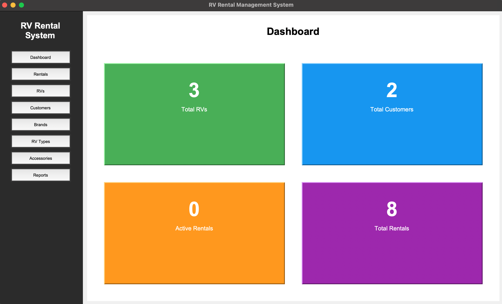
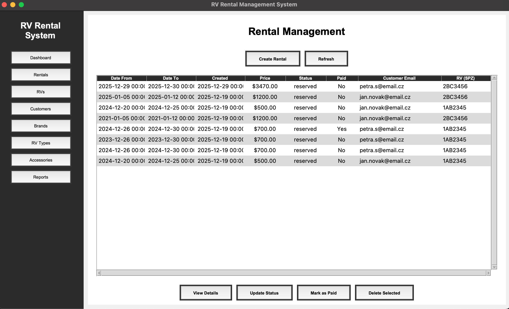

# RV-rental-app  
 this project is database management system application for RV rental companies

## Project Structure

```text
project/
├── config.json
├── main.py
├── requirements.txt
├── README.md
├── bin/
    ├── RVRentalApp.exe
    ├── RVRentalApp.spec
    └── main.spec
├── test/
    ├── TestCases.pdf
    ├── test_import_files/
        ├── accessories.json
        ├── brands.csv
        ├── customers.csv
        └── rv_types.json
├── doc/
    ├── diagram.png
    ├── example1.png
    └── example2.png
└── src/
    ├── app/
        └── services/
            ├── accessory_service.py
            ├── brand_service.py
            ├── customer_service.py
            ├── import_service.py
            ├── rental_service.py
            ├── report_service.py
            ├── rv_service.py
            └── rv_type_service.py
    
    ├── db/
        ├── dao/
            ├── accessory.py
            ├── accessory_rental.py
            ├── brand.py
            ├── customer.py
            ├── rental.py
            ├── rv.py
            └── rv_type.py
        ├── sql/
            ├── create_database_script.sql
            ├── procedure_create_script.sql
            └── view_create_script.sql
        ├── config.json
        ├── config_load.py
        ├── database.py
        └── report.py
    └── ui/
        ├── views/
            ├── accessory/
                ├── accessory_dialog.py
                └── accessory_view.py
            ├── brand/
                ├── brand_dialog.py
                └── brand_view.py
            ├── customer/
                ├── customer_dialog.py
                └── customer_view.py
            ├── rental/
                ├── rental_details_dialog.py
                ├── rental_dialog.py
                └── rental_view.py
            ├── report/
                └── report_view.py
            ├── rv/
                ├── rv_dialog.py
                └── rv_view.py
            ├── rv_type/
                ├── rv_type_dialog.py
                └── rv_type_view.py
            └── import_view.py
        └── main_window.py
```
 
## Layout  
### Dashborad
<br>

- This page shows the number of Rvs, Customers, Rentals and Active Rentals<br>

### Example (rentals page)  
<br>

- This page shows all the rentals in the database and how can you modify, add and delete them<br>

## Installation and setup

### Prerequisites  

- Python 3.10 or newer
- Oracle database (XE)
- Oracle SQL Developer
- pip

### 1. Oracle database Setup
#### 1.1 Create database schema  

1. open Oracle SQL Developer
2. Click new Connection
3. enter the following information: 
```text
- Connection Name: RvRentalApp
- Username: system (or another admin user)
- Password: your admin password
- Connection Type: Basic
- Hostname: localhost
- Port: 1521
- Service Name: XEPDB1  
```
4. Click Test
5. Click Save and Connect

#### 1.2 Create a New Database User

```sql
CREATE USER RV_RENTAL_APP IDENTIFIED BY password;
GRANT CONNECT, RESOURCE TO RV_RENTAL_APP;

```
You can change the username and password if needed

#### 1.3 Create a New Connection for the Application User
1. Click new Connection again
2. Use the following details:
```text
- Connection Name: RvRentalApp_User
- Username: RV_RENTAL_APP
- Password: password
- Hostname: localhost
- Port: 1521
- Service Name: XEPDB1
```
3. Click Test
4. Click Save and Connect

### 2. database creation

Using the RV_RENTAL_APP connection, execute the SQL scripts in this order:
1. src/db/sql/create_database_script.sql
2. src/db/sql/procedure_create_script.sql
3. src/db/sql/view_create_script.sql

Verify that tables, procedures, views were created successfully

### 3. Database Configuration

Edit the configuration file: src/db/config.json

example configuration:
```json
{
  "user": "RV_RENTAL_APP",
  "password": "password",
  "host": "localhost",
  "port": 1521,
  "service_name": "XEPDB1"
}
```
Make sure the credentials match the database user you created

### 4. Clone the project

1. Clone the database
2. Install requirements:
```terminaloutput
pip install -r requirements.txt
```

3. from the project root directory, run:
```terminaloutput
python src/ui/main_window.py
```

## Notes

- The Oracle database must be running before starting the application
